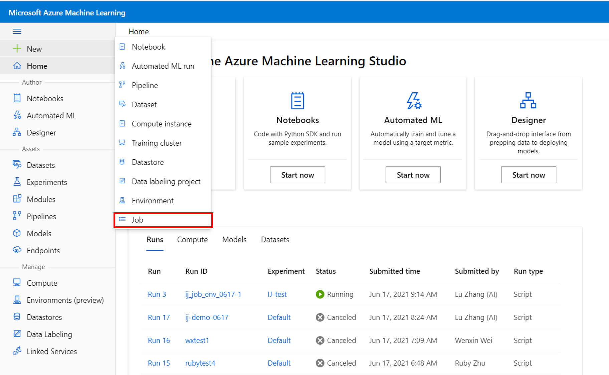
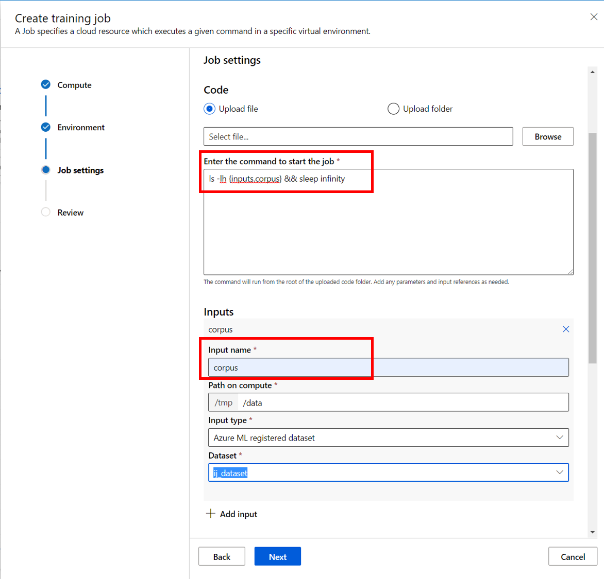
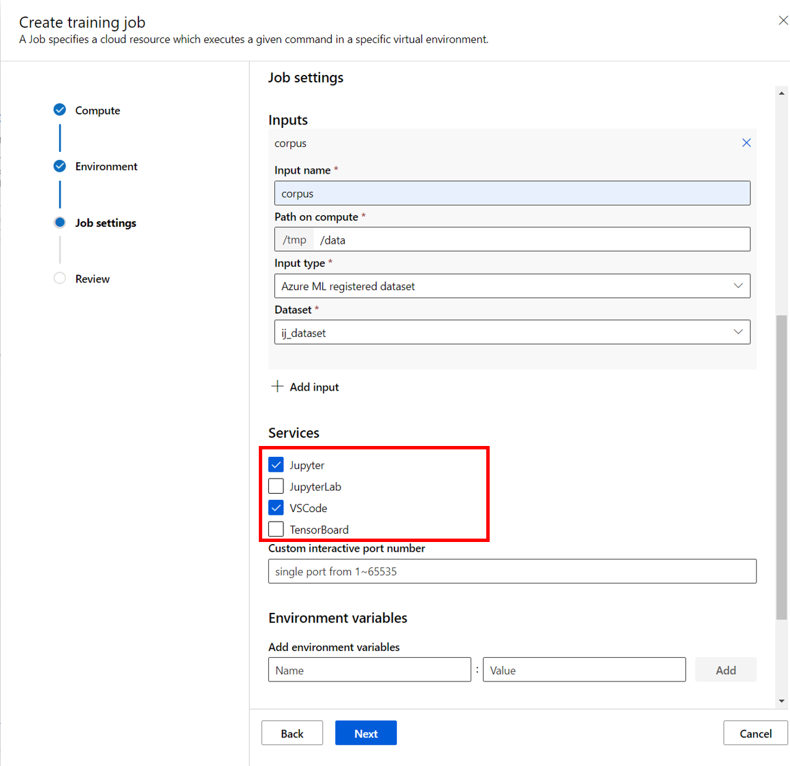
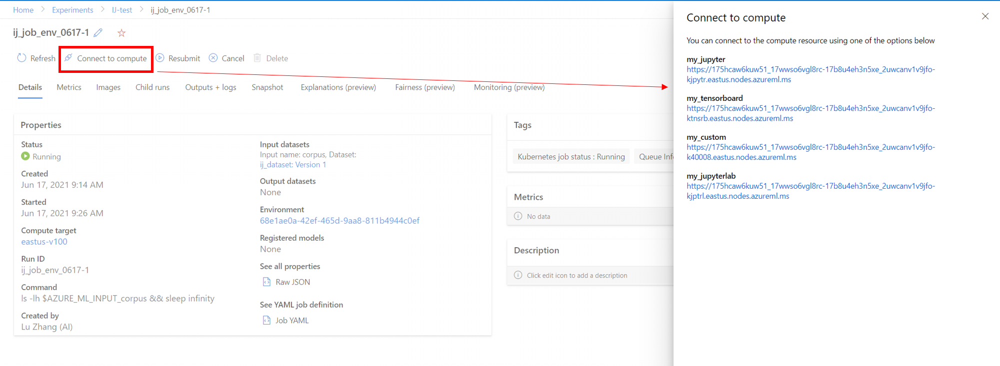
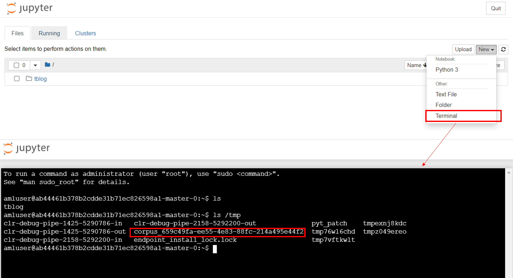

## Overview
ML model training usually requires lots of experimentation and iterations. With the new AzureML interactive job experience, data scientists can now use 2.0 CLI or the studio portal to quickly check out their required compute resources with custom environment, login to the compute target via JupyterNotebook, JupyterLab, VSCode, TensorBoard and custom endpoints to run training scripts, monitor the training progress or debug & troubleshoot the model like they usually do on their local machines, while keeping the operation cost optimized for resource allocation and utilization as a team.

Interactive job is supported on **AMLArc Compute** and will be available on AML Compute and Compute Instance in later releases.

## Prerequisites
- Complete the **Prerequisites** and **Getting started** in [this document](https://github.com/Azure/AML-Kubernetes)
- When you deploy AzureML extension to your Azure Arc enabled Kubernetes cluster (`az k8s-extension create`), make sure you append the configurations to turn on interactive job.
    - If you are running on AKS, append `amloperator.enableInteractiveProxy=True amloperator.interactiveProxyPort=4443` in `--configuration-settings` like below (if your cluster is already running, `az k8s-extension create` will update the settings):

    ```
    az k8s-extension create --cluster-type connectedClusters --cluster-name <myAzureArcK8s> --resource-group <myRG> --name trainingCompute --extension-type Microsoft.AzureML.Kubernetes --scope cluster --configuration-settings enableTraining=True amloperator.enableInteractiveProxy=True amloperator.interactiveProxyPort=4443
    ```
    - If you are on Kubernetes onprem, you need to configure `amloperator.entryPointMachineForEndpoint` as one of the machines (IP or machine name) in Kubernetes cluster.

**Note:** The 2 steps above are usually done by your admin.
- (Optional) [an AzureML dataset is created](https://docs.microsoft.com/en-us/azure/machine-learning/how-to-connect-data-ui) if your input data is downloaded in Azure blob. You can skip this step if you will download data after you log in to the interactive job.

## Get started
### Submit an interactive job via AzureML 2.0 CLI
1. [Install, set up and get familiar with the 2.0 CLI](https://docs.microsoft.com/en-us/azure/machine-learning/how-to-configure-cli).
1. Create a job yaml `job.yaml` with below content. Make sure to replace `your job name` and `your attached amlarc compute name` with your own values. If you want to use custom environment, follow the examples in [this tutorial](https://docs.microsoft.com/en-us/azure/machine-learning/how-to-train-cli). 
```dotnetcli
name: <your job name> #job name needs to be updated every time you submit it
command: sleep infinity # you can add other commands before "sleep infinity" but make sure "sleep infinity" is put at the end so that the resource is reserved.
environment: azureml:AzureML-sklearn-0.24-ubuntu18.04-py37-cpu:5
compute:
  target: azureml:<your attached amlarc compute name>
services:
  "my_jupyter":
    job_service_type: "Jupyter" # Jupyter Notebook
  "my_tensorboard":
    job_service_type: "TensorBoard"
    properties:
      logDir: "~/tblog" # where you want to store the TensorBoard output 
  "my_jupyterlab":
    job_service_type: "JupyterLab"
  "my_vscode":
    job_service_type: "vscode"
```
You can also put `sleep <specific time>` at the end of the command to speicify the amount of time you want to reserve the compute resource. The format follows: 
* sleep 1s
* sleep 1m
* sleep 1h
* sleep 1d
 
 Note that if you put `sleep infinity`, you will need to cancel the job after you finish the work. We are working on an auto termination policy for this scenario. 
 
3. Run command `az ml job create --workspace-name <your workspace name> --resource-group <your resource group name> --subscription <sub-id> --file <path to your job yaml file> `

### Submit an interactive job via AzureML studio portal
1. Create a new job from the left navigation pane or homepage of the studio portal (**turn on flight** by appending `&flight=InteractiveJob` to the end of the URL).

1. Choose `Kubernetes` as the compute type and specify how many nodes you need in `Instance count`.

1. Follow the wizard to choose the environment you want to start the job.
1. In `Job settings` step, add your input dataset and reference it in your command to make sure it's mounted to your job. **Also make sure your command is ended with `sleep infinity` to reserve the resource.** An example is like below:

1. Select the services you want to interact with in the job.

1. Review and create the job. The job detail can be found under `Default` experiment.


### Connect to endpoints
1. It might take a few minutes to start the job and endpoints specified. After the job is submitted and in **Running** state, you can connect to the endpoints by finding them from the run detail page on the studio.
1. You can connect to these endpoints by clicking the links from **Connect to compute**. Please note only job owner is authorized to connect to these endpoints.

1. Open a terminal from Jupyter Notebook or Jupyter Lab and start interacting within the job container. You are landed on the home folder **/home/amluser**. **my_files** is a user level folder where you can keep your scripts and output data there. Next time when you submit a new job, this folder will be mounted to it as well.

1. You can find the mounted data in `/tmp` folder.
 
1. If you run into any issues, the interactive endpoint logs can be found from **azureml-logs->azureml->services** and **azureml-logs->70_driver_log.txt** under **Outputs + logs** tab.


### Release the compute resource
1. Once you are done with the training, go to the run detail page to cancel the job. This will release the compute resource. Alternatively, use `az ml job cancel -n <your job name> -w <your workspace name> -g <your resource group name>`


### Resubmit a job with the previous settings
1. You can resubmit a job on the run detail page by clicking **Resubmit**. The wizard will have all the settings kept in previous run. You can also resubmit other's job if needed.


## Contact us
Reach out to us: interactivejobsfc@microsoft.com if you have any questions or feedback.
